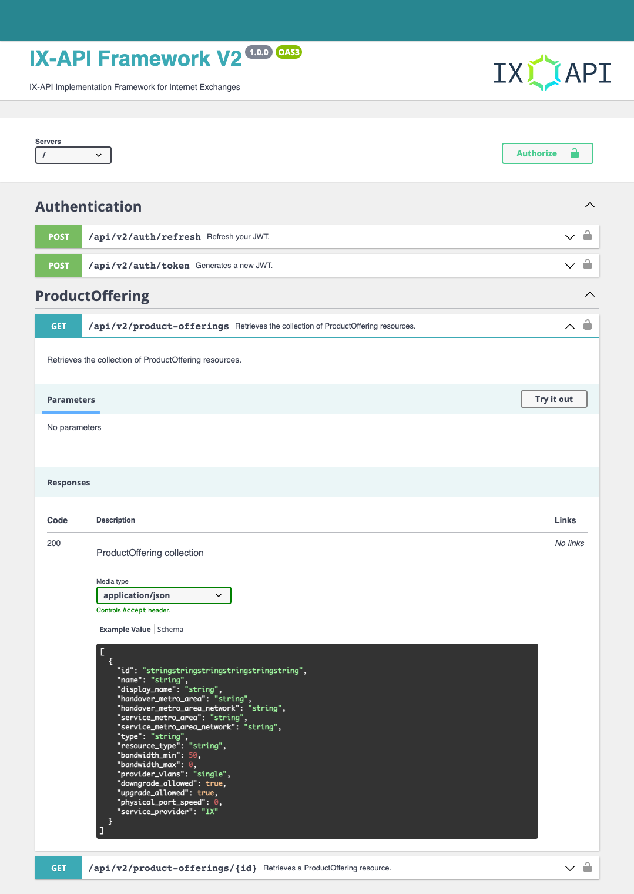

# ix-api-framework

- IX-API Project: https://ix-api.net/
- IX-API V2 Schema: https://docs.ix-api.net/v2/redoc

## What is this framework?
The project provides a base template for IX-API to make it simpler and faster to implement.

The implementation framework is written in PHP using [Symfony](https://symfony.com/), [API Platform](https://api-platform.com/) framework. 
API Platform has extensive documentation which it is recommended to be familiar with to understand the inner workings.

## How does this framework work?
API Platform maps class based entities to RESTful API endpoints, this suits the IX-API schema.

All IX-API endpoints have been coded as entity classes, this means all an implementor has to do is map their internal
business logic to and from these classes to have a functioning implementation.

## What is included?
- JWT based authentication and security including assignable roles per endpoint and method
- IX-API entities for each endpoint in the schema
- Basic test suite based on Codeception, by default authentication is covered
- Swagger UI auto generated via API Platform
- Docker image for quick development setup

## Installation
1. Setup JWT keys with a password, **keep a note of this for the next step**
   ```bash
   openssl genpkey -out config/jwt/private.pem -aes256 -algorithm rsa -pkeyopt rsa_keygen_bits:4096`
   openssl pkey -in config/jwt/private.pem -out config/jwt/public.pem -pubout
   ```
2. Run `cp .env .env.local`
3. Setup your local environment variables
    * Change `DATABASE_URL` if required, defaults to local Docker
    * Update `JWT_PASSPHRASE=` according to the step **1**.
4. Run `docker-compose up`
5. Browse to `https://localhost`

## Swagger UI


## How to enable certain entities only?
It is possible to toggle enabled entities via `config/packages/api_platform.yaml` config file:
```yaml
api_platform:
    mapping:
        paths:
```

## Tests
Tests can be run via the script: `run_tests.sh`.

Tests run on a separate `api_test` database that is populated with fixtures found in `/fixtures`.

## Version Support
This branch supports V2 schema, future branches will support further versions.
